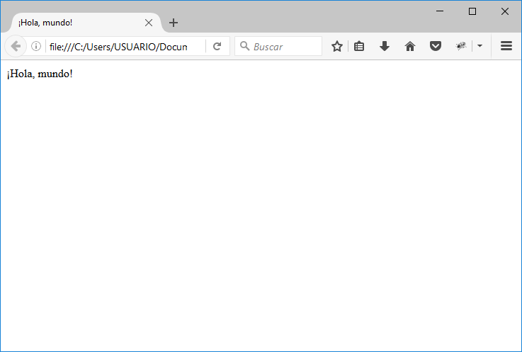
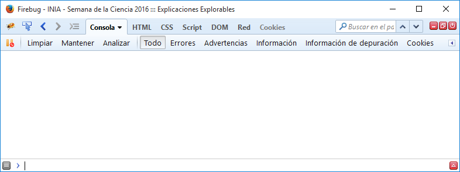
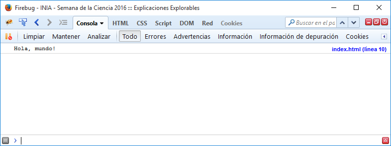
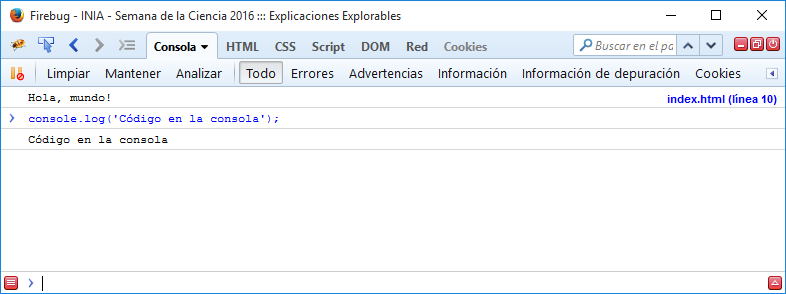

# Semana de la Ciencia 2016 @ INIA

## Explorable Explanations

***Explorable Explanations*** es un término acuñado por el ingeniero y diseñador Bret Victor para referirse a un documento interactivo, de carácter científico-técnico, que explica determinado concepto dando la oportunidad al lector de explorar los cambios que ocurren en el sistema o proceso cuando se modifican algunas de las variables que lo controlan.

Las páginas web y las aplicaciones para móvil o para tablet son el lugar ideal para estas Explicaciones Explorables, pero no significa que sea el único medio en el que se pueden construir. Una alternativa podrían ser los libros interactivos, con mecanismos simples de papel.

En este taller vamos a ver como podemos construir una sencilla web que nos ayude a explicar la relación que hay en un incendio forestal entre el material inflamado, la velocidad de propagación del fuego, el tamaño de la llama, y los medios de extinción más adecuados en cada caso.

Para ello construiremos progresivamente una página web interactiva con Javascript.

## Estructura básica de una página web

Como algunos sabréis las páginas web están escritas en lenguaje HTML. La estructura más básica que podemos construir es:

```html
<html lang="es">
  <head>
    <meta charset="utf-8">
    <title>¡Hola, mundo!</title>
  </head>

  <body>
    <p>¡Hola, mundo!</p>
  </body>
</html>
```

Antes de seguir creemos un fichero llamado `index.html` en una carpeta adecuada de nuestro ordenador, y copiemos o mejor, escribamos en él, el código de ejemplo. Después podemos abrir dicho fichero con nuestro navegador, y podremos ver el resultado de la página web.



**HTML** es un lenguaje de etiquetas. Cada sección del documento está comprendida entre una etiqueta de apertura `<tag>` y su correspondiente etiqueta de cierre `</tag>`.

Las etiquetas `<html>` y `</html>` limitan el princpio y el final del documento. También podemos ver que el documento se divide en dos secciones principales, una limitada por la etiqueta `<head>` donde se indican aspectos de configuración de la página web; y otra limitada por la etiqueta `<body>` donde está el contenido de la página propiamente dicho.

En este taller pasaremos de puntillas sobre muchos aspectos de **HTML**. Los interesados en profundizar en esta materia pueden seguir la documentación de **MDN** (Mozilla Developer Network): https://developer.mozilla.org/es/docs/Learn/HTML

## Introducción a Javascript

Desde que el navegador Netscape incluyera por primera vez la posibilidad de ejecutar código Javascript en 1995, este lenguaje se han convertido en el estándar para desarrollo en el lado del cliente de la web.

Javascript tiene una sintáxis de la familia de C, similar a la de muchos lenguajes populares como C, C++, Java o PHP. Para incluir código Javascript en nuestra página web hacemos uso de la etiqueta `<script>`.

```html
<html lang="es">
  <head>
    <meta charset="utf-8">
    <title>INIA - Semana de la Ciencia 2016 ::: Explicaciones Explorables</title>
  </head>

  <body>
    <p>¡Hola, mundo!</p>
    <script>
      alert('Hola, mundo!');
    </script>
  </body>
</html>
```

La etiqueta `<script>` puede ser incluida tanto en la sección `head` como en la sección `body`. Puesto que los ficheros HTML se ejecutan conforme son leídos, colocar el bloque `script` al final de la sección `body`, da ciertas garantías que el contenido completo de la página web ha sido cargado antes de ejecutar el código.

Este ejemplo ejecuta la función `alert()` que indica al navegador que queremos mostrar un aviso, que requiere la aprobación ('Aceptar') del usuario antes de continuar.


## Busquemos un aliado: Firebug

**Firebug** es un plugin de Firefox que facilita el desarrollo de páginas web y aplicaciones. Se instala fácilmente desde el gestor de complementos de Firefox. Una vez instalado, Firebug aparece con el icono de un pequeño insecto en la barra de herramientas del navegador.


La suite de Firebug tiene distintas herramientas que nos facilitan el trabajo de desarrollo: Consola, HTML, CSS, Script, DOM, Red y Cookies.



La herramienta *Console* nos mostrará los mensajes de error que genere nuestro código Javascript, pero también podemos acceder a ella haciendo uso del comando `console.log()`.

```html
<script>
  console.log('Hola, mundo!');
</script>
```



También es posible escribir código Javascript directamente en la consola, lo que la hace una manera ideal de realizar pruebas y aprender interactivamente.



## Un viaje rápido por Javascript

Este taller, por su brevedad, solo pretende mostrar algunas características generales de Javascript, y unos pocos de los detalles que lo diferencian de otros lenguajes de programación.

Podemos hacer el siguiente recorrido directamente en la consola que abrimos en la sección anterior:

```javascript
// Javascript admite comentarios de línea

/*
  y comentarios de bloque
*/

var a; // declaramos una variable
a = 2; // y le podemos asignar un valor
var b;
b = "2"; // no es necesario declarar tipos
a == b; // y a veces no le importa demasiado
a === b; // pero le podemos pedir que tenga cuidado

// de todos modos casi siempre debemos tener cuidado nosotros

alert('Llamando la atención'); //podemos llamar a funciones
// y declarar nuestras propias funciones
function suma(sumando1, sumando2) { return sumando1 + sumando2; }

suma(a, a); // podemos llamar a nuestra propias funciones

var o = { parametro1: 1, parametro2: 22}; // esto es un objeto Javascript
o.parametro1; // accedemos a su interior con el operador .
o.parametro1 = o.parametro1 + o.parametro2;

var f = suma; // una función es un valor más que se puede guardar en una función
f(a, a);
o.fn = suma; // incluso en el parámetro de un objeto
o.fn(a, o.parametro1);

console.log('Llamada a la función log() del objeto console');

var log_original = console.log; // Javascript es muy perro
console.log = function(texto) { return log_original.call(this, 'Consola en huelga')};
console.log('texto de ejemplo');

```

Javascript tiene detalles bastante avanzados. Si os habéis fijado, las funciones son objetos que tienen algunas funciones incluídas por defecto, como `call()`. Por ejemplo, podéis hacer también `suma.call(null, 2, 2);`. Estas características hacen que sea un lenguaje realmente muy flexible.

# Una Explicación Explorable

Vamos a crear una sencilla página web, que muestre la fórmula de Byram y permita explorar su evolución con algunos valores para la velocidad de propagación y los materiales del incendio.

En primer lugar creamos una sencilla web con las fórmulas, los datos y un ejemplo de la parte explorable.

```html
<html lang="es">
  <head>
    <meta charset="utf-8">
    <title>INIA - Semana de la Ciencia 2016 ::: Explicaciones Explorables</title>
  </head>

  <body>
    <h1>Tamaño de la llama en incendios forestales</h1>
    <p>El tamaño de la llama en un incendio forestal puede ser calculado a partir de la velocidad de propagación, la cantidad de material y sus características según la fórmula:</p>

    <br/>
    <br/>
    

    <p>Conocemos algunos valores estándares de características de los materiales para distintos tipos
      de vegetación:
    </p>

    <table>
      <tr>
        <th>Vegetación</th>
        <th>Densidad (kg/m<sup>2</sup>)</th>
      </tr>
      <tr>
        <td>Pasto</td>
        <td>0.1</td>
      </tr>
      <tr>
        <td>Monte bajo</td>
        <td>0.8</td>
      </tr>
      <tr>
        <td>Bosque</td>
        <td>3.5</td>
      </tr>
    </table>

    <p> Nos encontramos ante un incendio de <em>pasto</em> que se mueve a una velocidad de <em>10</em> m/min.
      El valor de longitud de la llama esperado es <em>&lt;valor calculado&gt;</em>m.
    </p>

    <script>
      console.log('Hola, mundo!');
    </script>
  </body>
</html>
```

Hemos introducido un par de etiquetas nuevas, como <table> para construir la tabla de datos, o <em> para dar enfásis. Además hemos creado añadido las ecuaciones en forma de gráficos GIF (usando la herramienta online https://www.codecogs.com/latex/eqneditor.php).

Para añadir las imágenes podéis descargarlas del sitio web (https://github.com/inia-es/semanaCiencia16_iiff_src/tree/master/img). Este sitio web tiene todo el código de este ejemplo, pero si lo descargáis ahora arruinareis parte de la diversión.

